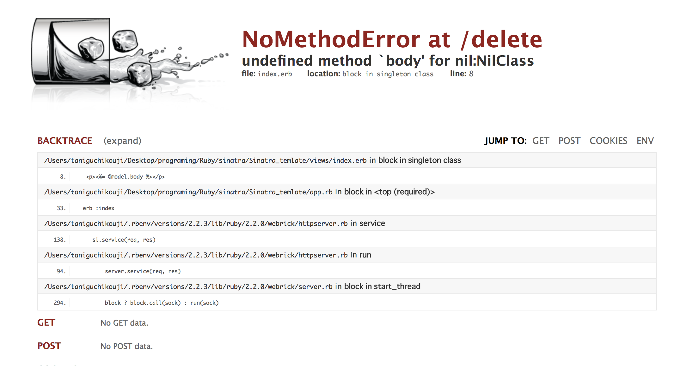
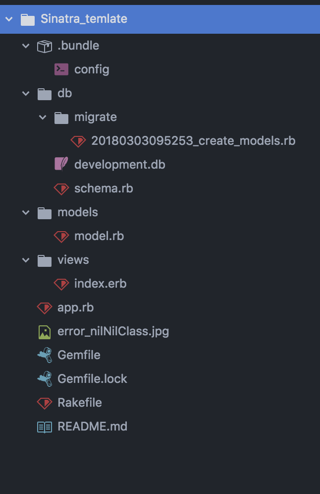

# sinatraテンプレート
ファイル作成から、DB作成、起動まで

## hello world

1.bundlerのinstall

```
$ gem install bundler
```

2.Gemfile作成


```:/Gemfile
source "https://rubygems.org"

gem 'rake'
gem 'sinatra'
gem 'sinatra-contrib'
gem 'activerecord'
gem 'sinatra-activerecord'

group :development do
  gem 'sqlite3'
end

group :production do
 gem 'pg'
end

```

```
$ bundle install --without production
```


4.view作成

```:/views/index.erb
<!DOCTYPE html>
<html>
  <head>
    <meta charset="utf-8">
    <title>sinatra_tempate</title>
  </head>
  <body>
    <p>hello world</p>
  </body>
</html>
```

5.app.rb作成

```ruby:app.rb
# Bundler.setupはGemfileの依存関係をrequireできるようload pathを設定する。
require 'bundler/setup'
# Bundler.requireはGemfileのgemを一括でrequireしている
Bundler.require

# コードを変更するたびに再起動しなくてよい,sinatra-contribのライブラリの一つ
# sinatra-contribについて(https://qiita.com/ma2saka/items/8e377fdc5f29bdb0ea66)
require 'sinatra/reloader' if

get '/' do
 erb :index
end

```

※require "sinatra"するとat_exitでSinatra::Application.run!がフックされる。(Bundler.requireでrequireされている)
Sinatra::ApplicationはRack::Serverのサブクラスではないので、newの際にRack::BuilderDSLを呼んだり、run!の際にRack::Handlerを探したりする実装が含まれている。

6.起動
** 保存を確認して 起動 **
```
$ ruby app.rb
```

デフォルトでは[http://localhost:4567/](http://localhost:4567/)にアクセス
hello worldが表示されたらok!

## database作成
1.modelファイル作成

``` :/models/model.rb
ActiveRecord::Base.establish_connection(ENV['DATABASE_URL'] || "sqlite3:db/development.db")
class Model << ActiveRecord
end
```

2.rakeファイル作成
``` :/Rakefile
require 'sinatra/activerecord'
require 'sinatra/activerecord/rake'
require './models/model.rb'
```

3.migrationfile作成

** ・tablenameは複数形で書くこと！**

** ・データベースのテーブルは複数形 **

** ・キャメルケースで書くこと！ **


```
$ rake db:create_migration NAME=create_tablename
例 $ rake db:create_migration NAME=create_models
```
実行するとdbフォルダが作成される

4.migrationfileを書く

```:db/migrate/20180303095253_create_models.rb
class CreateModels < ActiveRecord::Migration[5.1]
  def change
    create_table :models do |t|
      t.string :body
      t.integer :age
      t.timestamps null: false
    end
  end
end
```
* null - カラムでNULL値を許可または禁止します。

5.migrationfileをDBに反映させる
** 保存を確認して　実行 **
```
$ rake db:migrate
```
** このコマンド実行後にdb/development.dbとschema.rbが生成される **

実行後のlog(成功パターン)
 ```
 $ rake db:migrate
 == 20180303095253 CreateModels: migrating =====================================
-- create_table(:models)
   -> 0.0018s
== 20180303095253 CreateModels: migrated (0.0019s) ============================
```

実行後のlog(失敗パターン)
```
$ rake db:migrate
== 20180303095253 CreateModels: migrating =====================================
== 20180303095253 CreateModels: migrated (0.0000s) ============================
```
** migrationが失敗していてもエラーが出ないのでlogは要チェック **

## CRUD
app.rbでActiveRecord継承したmodelを使えるようにする
```:/models/model.rb
require 'bundler/setup'
Bundler.require
require 'sinatra/reloader' if
# ↓これを追加する
require './models/model.rb'
```

### create read
2.データを追加してviewで表示させる

```:/app.rb
get '/' do
  #Modelを使ってデータベースを操作する
  Model.create({
    body: 'hogehoge',
    age: 12,
    })

  @model = Model.all

 erb :index
end
```

```html:views/index.erb
<!DOCTYPE html>
<html>
  <head>
    <meta charset="utf-8">
    <title>sinatra_tempate</title>
  </head>
  <body>
    <p><%= @model.body %></p>
    <p><%= @model.age %></p>
  </body>
</html>
```
** 保存を確認 **

[http://localhost:4567/](http://localhost:4567/)にアクセスして
'hogehege'と12が表示されていればok


### update
データを新しい値に更新する

```:/app.rb
get '/' do
  Model.create({
    body: 'hogehoge',
    age: 12,
    })

  @model = Model.first

 erb :index
end

get '/update' do
   @model = Model.first
   @model.update({
     body: 'piyopiyo',
     age: 100,
     })
   @model = Model.first

   erb :index
end
```

** 保存を確認 **

[http://localhost:4567/update](http://localhost:4567/update)にアクセスして
'piyopiyo'と100が表示されていればok

### delete
データの削除

```:/app.rb
get '/' do
  Model.create({
    body: 'hogehoge',
    age: 12,
    })

  @model = Model.first

 erb :index
end

get '/update' do
   @model = Model.first
   @model.update({
     body: 'piyopiyo',
     age: 100,
     })
   @model = Model.first

   erb :index
end

get '/delete' do
   Model.first.destroy
   @model = Model.first

   erb :index
end

```
** 保存を確認 **

[http://localhost:4567/delete](http://localhost:4567/delete)にアクセスして


が出ればok!
データベースの中に何もデータが無いので、@modelがnillになっている

## 全体のファイルツリー構造

